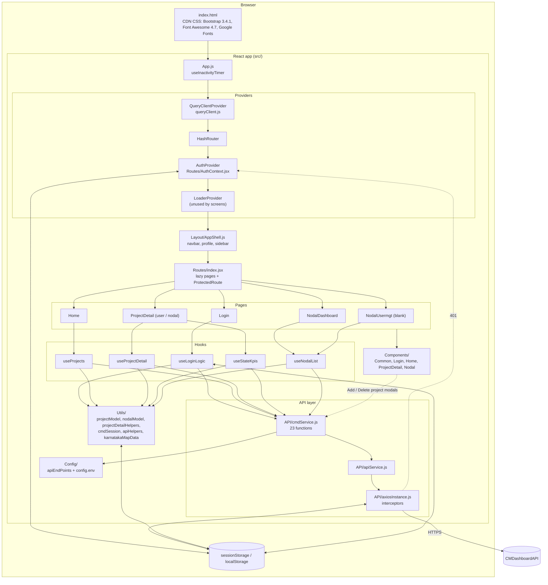

# 01 — Application Architecture

Related: [02_SYSTEM_ARCHITECTURE.md](../02_SYSTEM_ARCHITECTURE.md)

```mermaid
flowchart TB
    subgraph Browser["Browser"]
        HTML["index.html<br/>CDN CSS: Bootstrap 3.4.1, Font Awesome 4.7, Google Fonts"]
        subgraph React["React app (src/)"]
            APP["App.js<br/>useInactivityTimer"]
            subgraph Providers["Providers"]
                QC["QueryClientProvider<br/>queryClient.js"]
                HR["HashRouter"]
                AUTH["AuthProvider<br/>Routes/AuthContext.jsx"]
                LOAD["LoaderProvider<br/>(unused by screens)"]
            end
            SHELL["Layout/AppShell.js<br/>navbar, profile, sidebar"]
            ROUTES["Routes/index.jsx<br/>lazy pages + ProtectedRoute"]
            subgraph Pages["Pages"]
                PL["Login"]
                PH["Home"]
                PD["ProjectDetail (user / nodal)"]
                PN["NodalDashboard"]
                PU["NodalUsermgt (blank)"]
            end
            subgraph Hooks["Hooks"]
                HL["useLoginLogic"]
                HP["useProjects"]
                HD["useProjectDetail"]
                HK["useStateKpis"]
                HN["useNodalList"]
            end
            COMP["Components/<br/>Common, Login, Home, ProjectDetail, Nodal"]
            UT["Utils/<br/>projectModel, nodalModel, projectDetailHelpers,<br/>cmdSession, apiHelpers, karnatakaMapData"]
            subgraph APIL["API layer"]
                SVC["API/cmdService.js<br/>23 functions"]
                AS["API/apiService.js"]
                AX["API/axiosInstance.js<br/>interceptors"]
            end
            CFG["Config/<br/>apiEndPoints + config.env"]
        end
        STORE[("sessionStorage / localStorage")]
    end
    BE[("CMDashboardAPI")]

    HTML --> APP --> QC --> HR --> AUTH --> LOAD --> SHELL --> ROUTES
    ROUTES --> PL & PH & PD & PN & PU
    PL --> HL
    PH --> HP
    PD --> HD & HK
    PN & PU --> HN
    Pages --> COMP
    HL & HP & HD & HK & HN --> UT
    HL & HP & HD & HK & HN --> SVC
    COMP -.->|"Add / Delete project modals"| SVC
    SVC --> CFG
    SVC --> AS --> AX -->|"HTTPS"| BE
    AX -.->|"401"| AUTH
    AUTH & AX & UT & HL <--> STORE
```
