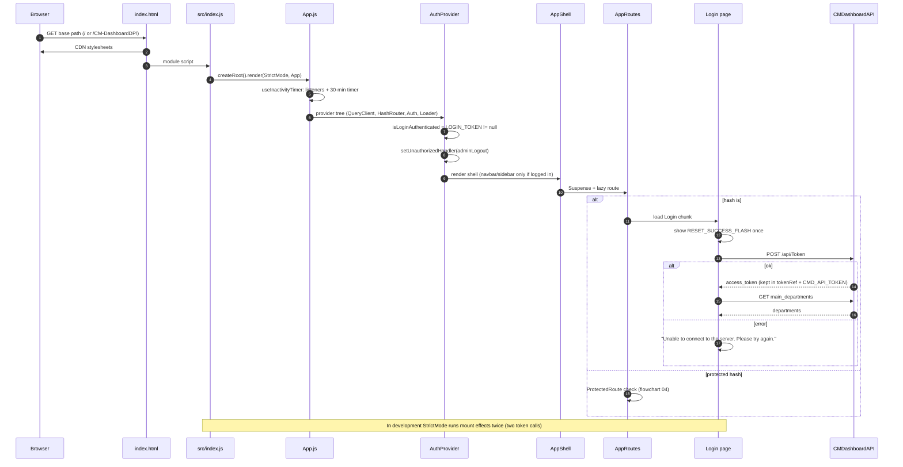

# 02 — Application Startup

Related: [01_PROJECT_OVERVIEW.md](../01_PROJECT_OVERVIEW.md)

```mermaid
sequenceDiagram
    autonumber
    participant B as Browser
    participant H as index.html
    participant I as src/index.js
    participant A as App.js
    participant AU as AuthProvider
    participant SH as AppShell
    participant R as AppRoutes
    participant L as Login page
    participant API as CMDashboardAPI

    B->>H: GET base path (/ or /CM-DashboardDP/)
    H->>B: CDN stylesheets
    H->>I: module script
    I->>A: createRoot().render(StrictMode, App)
    A->>A: useInactivityTimer: listeners + 30-min timer
    A->>AU: provider tree (QueryClient, HashRouter, Auth, Loader)
    AU->>AU: isLoginAuthenticated = LOGIN_TOKEN != null
    AU->>AU: setUnauthorizedHandler(adminLogout)
    AU->>SH: render shell (navbar/sidebar only if logged in)
    SH->>R: Suspense + lazy route
    alt hash is #/ or empty
        R->>L: load Login chunk
        L->>L: show RESET_SUCCESS_FLASH once
        L->>API: POST /api/Token
        alt ok
            API-->>L: access_token (kept in tokenRef + CMD_API_TOKEN)
            L->>API: GET main_departments
            API-->>L: departments
        else error
            L->>L: "Unable to connect to the server. Please try again."
        end
    else protected hash
        R->>R: ProtectedRoute check (flowchart 04)
    end
    Note over I,L: In development StrictMode runs mount effects twice (two token calls)
```
