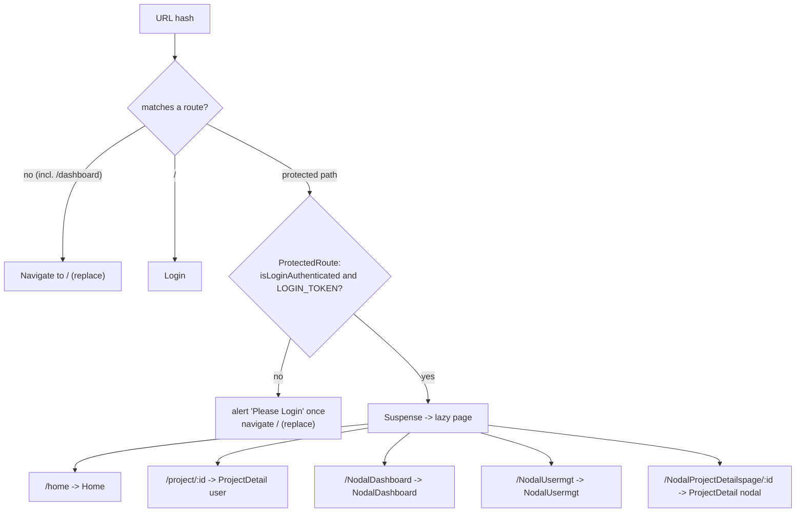
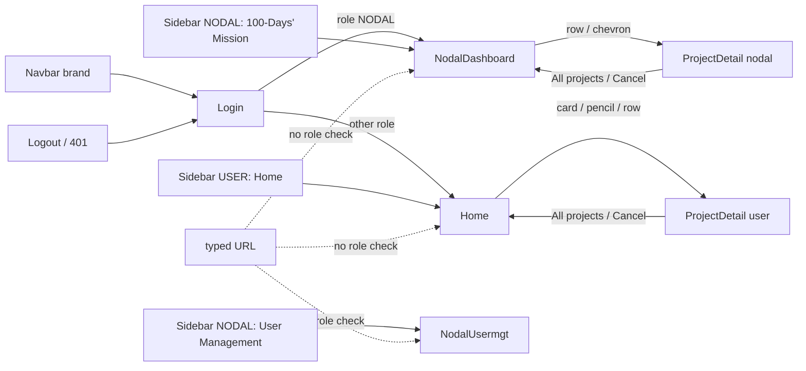

# 03 — Routing and Navigation

Related: [05_ROUTING_AND_NAVIGATION.md](../05_ROUTING_AND_NAVIGATION.md)

```mermaid
flowchart TD
    START["URL hash"] --> M{"matches a route?"}
    M -->|"no (incl. /dashboard)"| N["Navigate to / (replace)"]
    M -->|"/"| LOGIN["Login"]
    M -->|"protected path"| G{"ProtectedRoute:<br/>isLoginAuthenticated and LOGIN_TOKEN?"}
    G -->|"no"| G1["alert 'Please Login' once<br/>navigate / (replace)"]
    G -->|"yes"| S["Suspense -> lazy page"]
    S --> HOME["/home -> Home"]
    S --> PD["/project/:id -> ProjectDetail user"]
    S --> ND["/NodalDashboard -> NodalDashboard"]
    S --> NU["/NodalUsermgt -> NodalUsermgt"]
    S --> NPD["/NodalProjectDetailspage/:id -> ProjectDetail nodal"]
```

```mermaid
flowchart LR
    LOGIN["Login"] -->|"role NODAL"| ND["NodalDashboard"]
    LOGIN -->|"other role"| HOME["Home"]
    HOME -->|"card / pencil / row"| PD["ProjectDetail user"]
    PD -->|"All projects / Cancel"| HOME
    ND -->|"row / chevron"| NPD["ProjectDetail nodal"]
    NPD -->|"All projects / Cancel"| ND
    SBU["Sidebar USER: Home"] --> HOME
    SBN1["Sidebar NODAL: 100-Days' Mission"] --> ND
    SBN2["Sidebar NODAL: User Management"] --> NU["NodalUsermgt"]
    BRAND["Navbar brand"] --> LOGIN
    OUT["Logout / 401"] --> LOGIN
    URL["typed URL"] -.->|"no role check"| HOME & ND & NU
```
