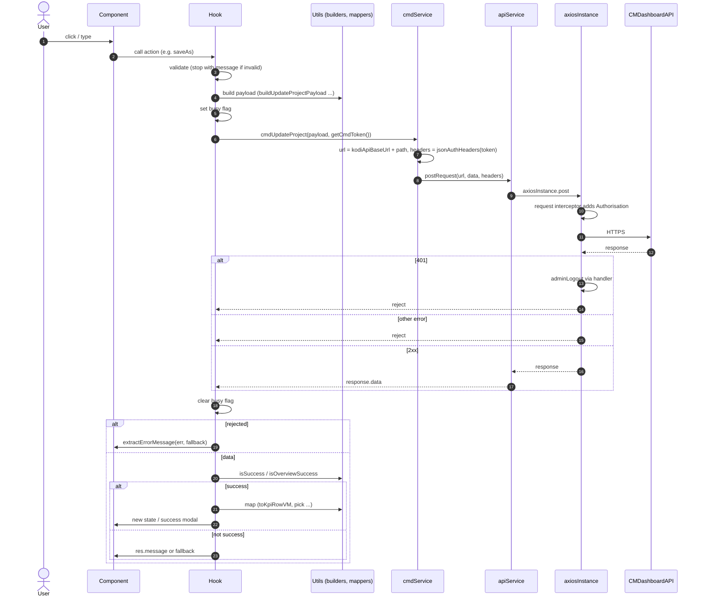
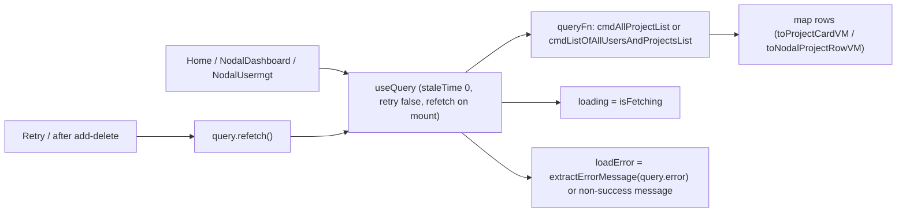

# 05 — API Request and Response Flow

Related: [06_API_AND_SERVICE_DOCUMENTATION.md](../06_API_AND_SERVICE_DOCUMENTATION.md)

```mermaid
sequenceDiagram
    autonumber
    actor U as User
    participant C as Component
    participant HK as Hook
    participant UT as Utils (builders, mappers)
    participant SV as cmdService
    participant AS as apiService
    participant AX as axiosInstance
    participant BE as CMDashboardAPI

    U->>C: click / type
    C->>HK: call action (e.g. saveAs)
    HK->>HK: validate (stop with message if invalid)
    HK->>UT: build payload (buildUpdateProjectPayload ...)
    HK->>HK: set busy flag
    HK->>SV: cmdUpdateProject(payload, getCmdToken())
    SV->>SV: url = kodiApiBaseUrl + path, headers = jsonAuthHeaders(token)
    SV->>AS: postRequest(url, data, headers)
    AS->>AX: axiosInstance.post
    AX->>AX: request interceptor adds Authorisation
    AX->>BE: HTTPS
    BE-->>AX: response
    alt 401
        AX->>AX: adminLogout via handler
        AX-->>HK: reject
    else other error
        AX-->>HK: reject
    else 2xx
        AX-->>AS: response
        AS-->>HK: response.data
    end
    HK->>HK: clear busy flag
    alt rejected
        HK->>C: extractErrorMessage(err, fallback)
    else data
        HK->>UT: isSuccess / isOverviewSuccess
        alt success
            HK->>UT: map (toKpiRowVM, pick ...)
            HK->>C: new state / success modal
        else not success
            HK->>C: res.message or fallback
        end
    end
```

## Read-only lists via TanStack Query

```mermaid
flowchart LR
    P["Home / NodalDashboard / NodalUsermgt"] --> Q["useQuery (staleTime 0, retry false, refetch on mount)"]
    Q --> F["queryFn: cmdAllProjectList or cmdListOfAllUsersAndProjectsList"]
    F --> M["map rows (toProjectCardVM / toNodalProjectRowVM)"]
    Q --> L["loading = isFetching"]
    Q --> E["loadError = extractErrorMessage(query.error) or non-success message"]
    R["Retry / after add-delete"] --> Q2["query.refetch()"] --> Q
```
