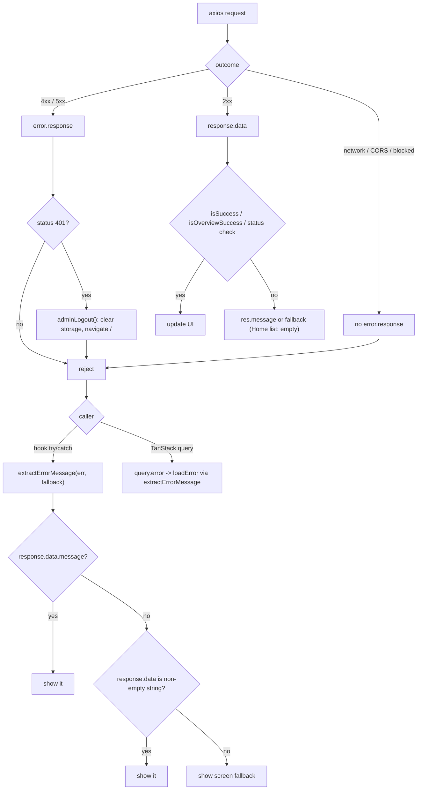
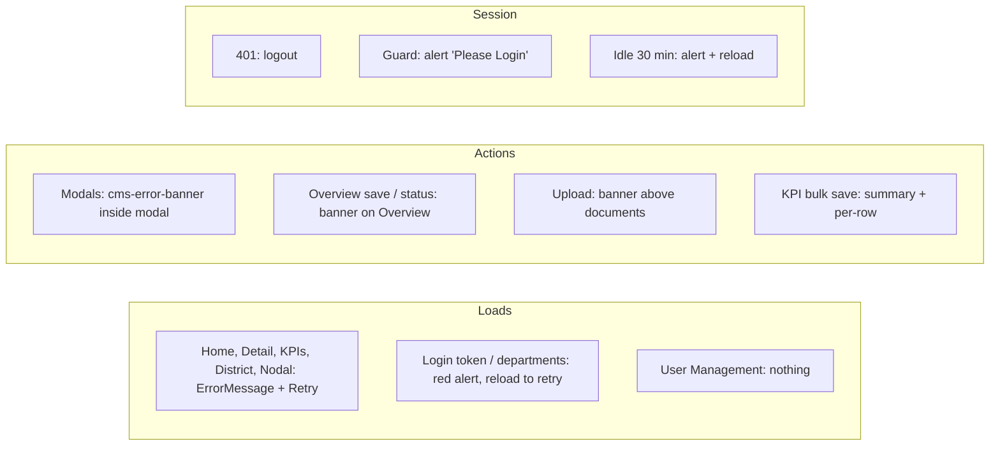
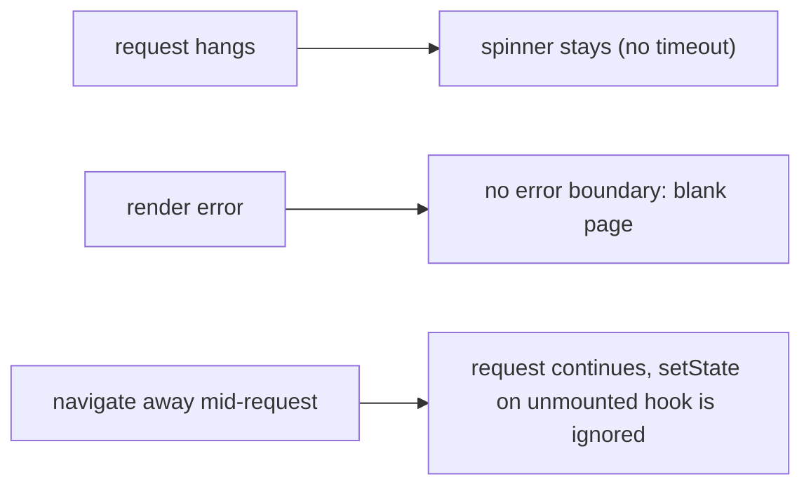

# 09 — Error Handling

Related: [13_ERROR_HANDLING_AND_TROUBLESHOOTING.md](../13_ERROR_HANDLING_AND_TROUBLESHOOTING.md)

```mermaid
flowchart TD
    A["axios request"] --> B{"outcome"}
    B -->|"network / CORS / blocked"| C["no error.response"]
    B -->|"4xx / 5xx"| D["error.response"]
    B -->|"2xx"| E["response.data"]
    D --> F{"status 401?"}
    F -->|"yes"| G["adminLogout(): clear storage, navigate /"]
    F -->|"no"| H["reject"]
    G --> H
    C --> H
    H --> I{"caller"}
    I -->|"hook try/catch"| J["extractErrorMessage(err, fallback)"]
    I -->|"TanStack query"| K["query.error -> loadError via extractErrorMessage"]
    J --> L{"response.data.message?"}
    L -->|"yes"| M["show it"]
    L -->|"no"| N{"response.data is non-empty string?"}
    N -->|"yes"| O["show it"]
    N -->|"no"| P["show screen fallback"]
    E --> Q{"isSuccess / isOverviewSuccess / status check"}
    Q -->|"yes"| R["update UI"]
    Q -->|"no"| S["res.message or fallback (Home list: empty)"]
```

## Where messages appear

```mermaid
flowchart LR
    subgraph Loads
        L1["Home, Detail, KPIs, District, Nodal: ErrorMessage + Retry"]
        L2["Login token / departments: red alert, reload to retry"]
        L3["User Management: nothing"]
    end
    subgraph Actions
        A1["Modals: cms-error-banner inside modal"]
        A2["Overview save / status: banner on Overview"]
        A3["Upload: banner above documents"]
        A4["KPI bulk save: summary + per-row"]
    end
    subgraph Session
        S1["401: logout"]
        S2["Guard: alert 'Please Login'"]
        S3["Idle 30 min: alert + reload"]
    end
```

## Not handled

```mermaid
flowchart LR
    X1["request hangs"] --> Y1["spinner stays (no timeout)"]
    X2["render error"] --> Y2["no error boundary: blank page"]
    X3["navigate away mid-request"] --> Y3["request continues, setState on unmounted hook is ignored"]
```
