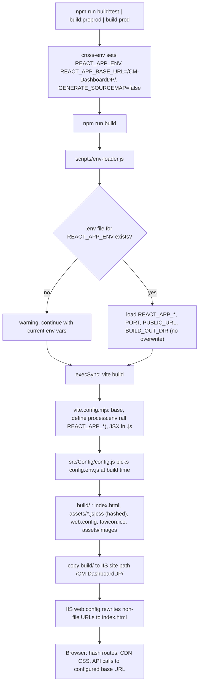
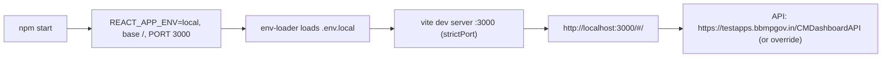
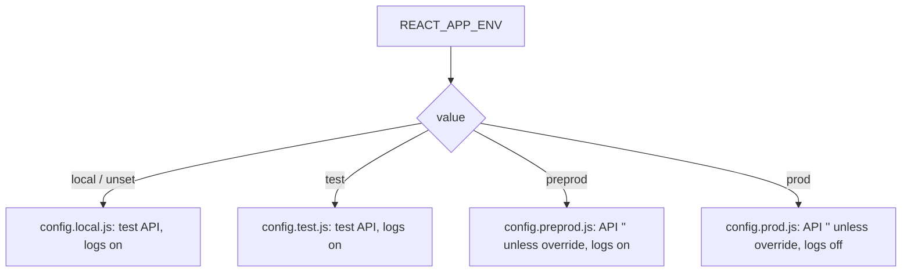

# 10 — Build and Deployment

Related: [12_CONFIGURATION_TESTING_AND_DEPLOYMENT.md](../12_CONFIGURATION_TESTING_AND_DEPLOYMENT.md)

```mermaid
flowchart TD
    A["npm run build:test | build:preprod | build:prod"] --> B["cross-env sets REACT_APP_ENV, REACT_APP_BASE_URL=/CM-DashboardDP/, GENERATE_SOURCEMAP=false"]
    B --> C["npm run build"] --> D["scripts/env-loader.js"]
    D --> E{".env file for REACT_APP_ENV exists?"}
    E -->|"no"| E1["warning, continue with current env vars"]
    E -->|"yes"| F["load REACT_APP_*, PORT, PUBLIC_URL, BUILD_OUT_DIR (no overwrite)"]
    E1 & F --> G["execSync: vite build"]
    G --> H["vite.config.mjs: base, define process.env (all REACT_APP_*), JSX in .js"]
    H --> I["src/Config/config.js picks config.env.js at build time"]
    I --> J["build/ : index.html, assets/*.js|css (hashed), web.config, favicon.ico, assets/images"]
    J --> K["copy build/ to IIS site path /CM-DashboardDP/"]
    K --> L["IIS web.config rewrites non-file URLs to index.html"]
    L --> M["Browser: hash routes, CDN CSS, API calls to configured base URL"]
```

## Development run

```mermaid
flowchart LR
    A["npm start"] --> B["REACT_APP_ENV=local, base /, PORT 3000"] --> C["env-loader loads .env.local"] --> D["vite dev server :3000 (strictPort)"] --> E["http://localhost:3000/#/"]
    E --> F["API: https://testapps.bbmpgov.in/CMDashboardAPI (or override)"]
```

## Environment decision

```mermaid
flowchart TD
    A["REACT_APP_ENV"] --> B{"value"}
    B -->|"local / unset"| C["config.local.js: test API, logs on"]
    B -->|"test"| D["config.test.js: test API, logs on"]
    B -->|"preprod"| E["config.preprod.js: API '' unless override, logs on"]
    B -->|"prod"| F["config.prod.js: API '' unless override, logs off"]
```
